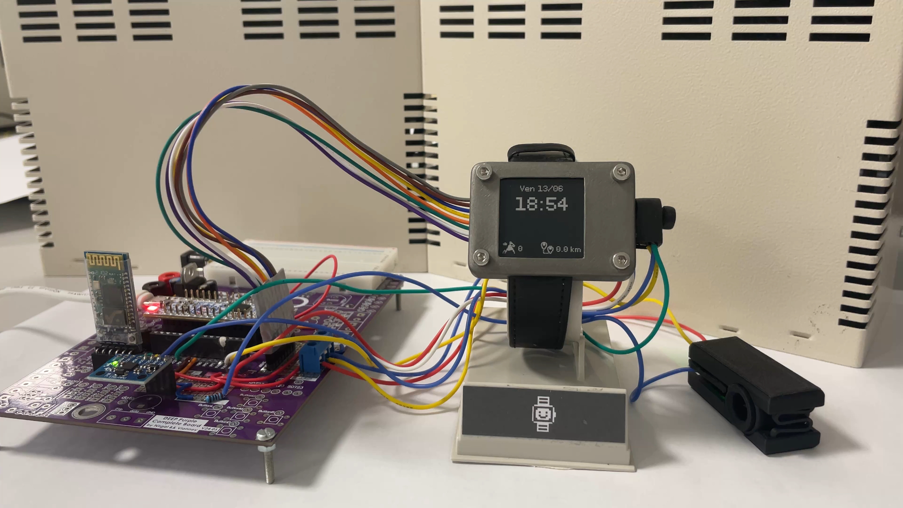

**Tictac is a smartwatch prototype built on STM32G4, featuring heart rate monitoring, step counting and Bluetooth time sync on an e-ink display.**

Tictac is built around an e-ink display, a PPG heart rate sensor, a 6-axis accelerometer and a Bluetooth module, all packed into a custom-routed PCB and a fully 3D-printed enclosure. 

*The project spans embedded C on STM32G4, signal processing prototyped in MATLAB, PCB design in Altium Designer, mechanical design in Fusion 360, and a companion Android app; all developed from scratch over one semester.*

<p align="center">
  
  
  
  
  
  
</p>

<h1 align="center"></h1>

<h5 align="center"><a href="https://milovan.me">milovan.me</a></h5>

## In a nutshell
- **What** : A smartwatch prototype with heart rate monitoring, step counting, time display and Bluetooth sync.
- **Why** : We wanted a project that was both technically ambitious and tangible; something you can actually wear and demo.
- **Context** : Embedded systems student project, two-person team.

## Showcase




## Documentation
### Find your happiness:
- ⚙️ [Hardware Architecture](./docs/architecture.md): Component list, pin mapping and wiring
- 🛠️ [Firmware](./docs/firmware.md): STM32G4, state machines, code architecture
- 📶 [Connectivity](./docs/connectivity.md): Bluetooth usage and handling
- 💓 [Heart-Rate Measurement](./docs/heartrate.md): PPG acquisition, bandpass filtering and BPM calculation
- 👟 [Step Counter](./docs/stepcounter.md): Accelerometer-based step detection and distance estimation
- 👤 [Human-Machine Interface](./docs/hmi.md): E-ink display, rotary encoder and menu navigation
- 🔌 [Electronics](./docs/electronics.md): Altium schematic, PCB routing, JLCPCB validation
- 📐 [Mechanical Design](./docs/cao.md): 3D-printed enclosure, pulse sensor jaw, dial and screen housing

## Repository Structure
```
├── hardware/        # Altium schematics, PCB
├── firmware/        # Source code
├── matlab/          # Signal processing scripts (PPG, pedometer)
├── docs/            # Documentation, conception notes
├── assets/          # Images, schematics and illustrations
└── case/            # 3D models
```
