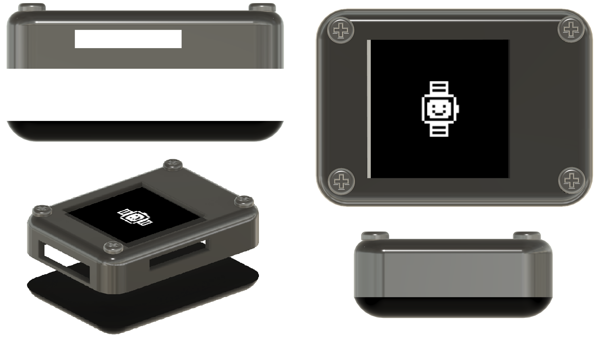

# 🖨️ Mechanical Design

## Overview

All mechanical parts for Tictac were designed in **Autodesk Fusion** and printed on a FDM printer. Three independent assemblies were produced:

- **The heart-rate sensor jaw:** A spring-loaded clamp that holds the finger against the HW827 optical sensor.
* **The rotary encoder housing:** A two-part shell that retains the encoder and the central push-button, topped by a custom knob.
- **The screen enclosure:** A two-part case that houses the e-paper display and provides strap attachment points.

Every part was tolerance-tested on the actual printer before the final print run; the clearance test settled on **0.5 mm** of play for moving joints and press-fit inserts.

## Heart-Rate Sensor Jaw
 
The jaw is the most mechanically complex sub-assembly. Its job is to press the user's finger firmly and consistently against the HW827's photodiode window, at the right angle and with the right contact force, because PPG signal quality is very sensitive to both.

> [!NOTE]
> The HW827 outputs a raw analog voltage; there is no pressure feedback. The jaw design
> trades the complexity of active force control for a passive spring mechanism calibrated
> to a typical fingertip.

The assembly is made up of five distinct parts described below.

> [!NOTE]
> Screenshots todo!

### Lower Jaw
 

> [!NOTE]
> Screenshots todo!
 
The lower jaw is the fixed base of the assembly. It is built around a rectangular main body that integrates several purpose-shaped inserts:

| Insert | Shape | Purpose |
|---|---|---|
| Spring seat | Rectangular | Locks the spring in place without adhesive |
| Pivot insert | Cylindrical, split | Receives the pivot axis and interlocks with the upper jaw |
| TPU pad seats | Trapezoidal | Friction-fit retention for the comfort pads |
| Sensor pocket | Flat-bottomed recess | Locates and protects the HW827 module |

A cable routing groove runs along the full length of the body and continues into the pivot zone, so the sensor wires reach the PCB without being pinched by the pivot motion. Two short cylindrical bosses on either side of the pivot zone mate with matching recesses in the upper jaw to form the hinge.

Chamfers and fillets are applied to all exposed edges for print quality and comfort.

### Upper Jaw

> [!NOTE]
> Screenshots todo!
 
The upper jaw mirrors the lower jaw's base volume and carries the same set of inserts; spring seat, TPU pad seats, and two cylindrical sockets that receive the lower jaw's hinge bosses, plus a central cylindrical hub that wraps around the pivot axis.
 
A cable groove identical to the lower jaw's is present, extended all the way through the hub, so that wires can exit toward the watch body once the jaw is assembled and closed around a finger.

### Pivot Axis
 

> [!NOTE]
> Screenshots todo!
 
The pivot axis is a stepped cylinder designed with **0.5 mm** clearance (matching the printer's calibrated tolerance). Key design decisions:
 
* A lengthwise slit allows the cylinder to compress slightly during insertion without
  cracking, acting as a snap-fit.
- A through-channel for cable routing runs the full length of the axis, aligning with the
  grooves in both jaws when assembled.

  
### TPU Comfort Pads

> [!NOTE]
> Screenshots todo!
 
Four distinct TPU pads (two upper, two lower) press-fit into their trapezoidal seats with 0.5 mm of play. TPU was chosen because it is flexible enough to conform to the finger's shape and can be printed on the same printer as the rigid PLA parts, just with a different filament loaded. The trapezoidal cross-section prevents the pads from pulling out under the spring's closing force.
 
A clearance slot on the lower jaw's pad seats allows the HW827 sensor module to be swapped out independently, without having to disassemble the entire jaw.

### 3D-Printed Spring

> [!NOTE]
> Screenshots todo!
 
The spring is a thick serpentine structure (1 mm wall thickness) printed in PLA.
 
> [!NOTE]
> Print orientation is critical here: the spring **must** be printed flat (i.e. the
> serpentine loops lying in the XY build plane). Printing it upright stacks the layer
> boundaries perpendicular to the bending stress, which causes delamination
> failure. The flat orientation distributes stress along layer lines instead of across
> them.

## Rotary Encoder Housing
 
The encoder used for menu navigation is a salvaged mouse scroll-wheel encoder; a bare quadrature encoder with **no integrated push-button**. A separate tactile push-button is placed behind it in the same housing. The housing's job is therefore twofold: combine both components into a single compact unit, and mechanically couple the knob's downward press to the push-button that sits behind the encoder's shaft.
 
The result is a single user-facing control that both rotates and clicks, even though those two functions come from two completely independent components. See [Architecture documentation](./architecture.md#component-details) and [Firmware documentation](./firmware.md#rotary-encoder-integration) for how the firmware reads each one.

> [!NOTE]
> Screenshots todo!

### Lower Shell
 

> [!NOTE]
> Screenshots todo!
 
The lower shell holds both components in their correct relative positions. Two slots on opposite sides of the frame grip the mouse encoder's steel retaining tabs, fixing it horizontally and flush with the shell surface. Behind the encoder, a rectangular recess locates the push-button: four small pillars at the bottom of the recess align with the button's four legs for precise, repeatable placement.

### Upper Shell
 

> [!NOTE]
> Screenshots todo!
 
The upper shell constrains the encoder laterally but leaves it free to travel vertically. This vertical freedom is intentional: when the user presses the knob down, the encoder body slides inside the housing and its shaft end bears against the push-button behind it, actuating it. The shell depth is sized so the button can reach both its unpressed and fully-depressed positions without the encoder bottoming out on the shell walls.
 
A central cylindrical bore passes the encoder's shaft through to the outside.
 
### Knob
 

> [!NOTE]
> Screenshots todo!
 
The knob is a three-part body in a single printed piece:
 
| Part | Role |
|---|---|
| Shaft insert | Press-fits onto the encoder's D-shaft to transmit rotation |
| Reinforcement base | Widens the cross-section just above the shaft insert to prevent cracking under torque |
| Outer grip dome | Finger-contact surface; a ring of symmetrically arranged rounded lobes provides grip |
 
The lobes are small enough that their surface finish was noticeably affected by printer
resolution. A light sanding pass after printing was needed to remove layer-step artefacts
before the knob felt smooth to use.

## Screen Enclosure
 
The screen enclosure houses the **epd1in54_V2** e-paper display (`200×200 px`, `1.54″`) and serves as the primary watch body that the user sees. See [Architecture documentation](./architecture.md#component-details) for display specs.
 

 
The enclosure is split into two parts along a horizontal parting line.

### Main Body
 
The main body is a silver open frame designed around the display's footprint. It includes:
 
- A rectangular window exposing the active display area.
- Two lateral slots for attaching watch strap lugs.
- A cable passage channel for the SPI ribbon connecting to the PCB.
- A rectangular recess on one side that accepts the encoder housing as a snap-in
  sub-assembly.
All external edges carry fillets to soften the form. Four screw holes are present on the outer face, used to bolt the e-paper display module securely inside the enclosure.

### Cover

The cover is a solid black parallelepiped with fully filleted edges. It has no clip, latch, or retention feature of any kind; a known design shortcoming. In practice it was held against the main body with poster tack. 

> [!NOTE]
> Yes, the back of a prototype smartwatch is held on with poster tack. No, this is not
> how consumer electronics are manufactured. For our defense, the deadline was approaching,
> but it held and the demo went fine!
 
## Print Settings Summary
 
| Parameter | Value |
|---|---|
| Material (structural parts) | PLA |
| Material (pads) | TPU |
| Clearance for moving joints | 0.5 mm |
| Clearance for press-fits | 0.5 mm |
| Spring print orientation | Flat (XY plane) |
| Post-processing | Sanding on knob grip surface |

