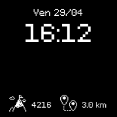
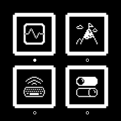
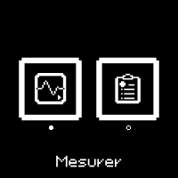
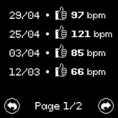
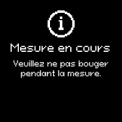
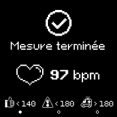

# 👤 Human-Machine Interface
 
## Overview
 
The interface is deliberately minimal: one rotary encoder for navigation, one central pushbutton for validation, and a small monochrome display; here a `200×200px` Waveshare e-paper panel instead of an OLED. Low refresh rate and no touch input mean the UI leans entirely on the encoder + button + an icon grid rather than any kind of gesture or text input.
 
The low-level encoder/button driver details are covered in [Firmware documentation](./firmware.md#rotary-encoder-integration); this page covers what actually gets drawn, and how the menu's nested state machines fit together.

## Design tool
 
The screens themselves: icons, menu layouts, the measurement and result screens were designed in **Figma** before being translated into bitmaps and `Paint_DrawBitMap_Paste()` / `Paint_DrawString_EN()` calls in the firmware. Figma made it possible to lay out and iterate on the `200×200` monochrome interface visually before committing to pixel coordinates in C.

## Display Hardware
 
`EPD_SPI_Init()` configures **SPI1** as master for the e-paper:
 
```c
GPIO_InitStruct.Pin = GPIO_PIN_5 | GPIO_PIN_6 | GPIO_PIN_7; // PA5=SCK, PA6=MISO, PA7=MOSI
GPIO_InitStruct.Alternate = GPIO_AF5_SPI1;
...
hspi1.Init.BaudRatePrescaler = SPI_BAUDRATEPRESCALER_8;
```

`CS`, `DC`, `BUSY` and `RST` (see [Architecture documentation](./architecture.md#pin-mapping)) are plain GPIO, bit-banged from a lower driver layer; `EPD_SPI_Init()` only owns the three SPI1 bus pins.

### Init mode
 
| Function              | Background | Used for                                      | Called from `main.c`? |
|------------------------|--------------|--------------------------------------------------|--------------------------|
| `EPD_Init()`           | White (`0xFF`) | Full-screen redraw, called once at boot          | **Yes**                  |
 
It allocates a `((200+7)/8) × 200 = 5000` byte, 1-bit-per-pixel buffer (`BlackImage`) via `malloc()`, then hand it to the `Paint_*` graphics library with a `90°` rotation.

## Idle Screen

<p align="center">
  
</p> 

```c
void EPD_Display_Idle(uint16_t pas) {
    Paint_DrawBitMap(image);
    /* ... time, date, step count and distance rendering, all commented out ... */
    EPD_1IN54_V2_Display(BlackImage);
}
```

## Main Menu
 
`EPD_DrawMenuFrames()` lays out four `71×71` boxes in a 2×2 grid (`16 px` gap), each holding a
`36×36` icon:

<p align="center">
  
</p>

A filled/empty dot under each box (`EPD_UpdateMenuDisplay()`) shows the current selection (`etatActuel`, `1`–`4`), driven by the encoder (`EPD_MenuEncoderCallback()`, wraps circularly, `100 ms` debounce) and validated by the central button (`EPD_HandleMenuNavigation()`, polled every `10 ms`, on top of the button's own `50 ms` debounce; see [Firmware documentation](./firmware.md#central-button)). A `7 s` inactivity timeout (`IDLE_TIMEOUT_MS`) returns to the main menu, matching the user manual.
 
### NFC and Settings are stubs
 
Selecting `NFC` shows a static, non-interactive 3-icon screen (`EPD_Display_MenuNFC()`) with no button handling of its own. Selecting `PARAMETRES` does even less; its entire state-machine case is `currentState = MAIN; EPD_Display_Reset(); return SM_RUNNING;`: no settings screen is ever drawn, the menu just bounces straight back.

## Heart-Rate Submenu & Measurement: three nested state machines
 
The heart-rate feature is implemented as three state machines, each delegating to the next:
 
```
main.c: stateMachine()
  └─ MENU ──► EPD_StateMachine()                         [epaper_displays.c]
        └─ POULS ──► EPD_Pouls_StateMachine()            [epaper_pouls.c]
              └─ MESURE ──► EPD_Pouls_Mesure_StateMachine() [epaper_pouls_mesure.c]
                    ├─ MESURE: blocking HW827 recording + calcule_bpm() (~10.36 s)
                    └─ DONE:   show result for 5 s
```
 
Each layer has its own `MENU`/`DONE`-style states whose only job is to notice that the layer below just returned `SM_FINISHED`, and pass that fact up one level; on the next polling iteration, not the same one. Concretely: when the innermost measurement finishes, it takes **two extra passes through the outer state machines** before control is back at the idle screen; one for `EPD_Pouls_StateMachine()`'s own `DONE` state to fire, one more for `EPD_StateMachine()`'s.

### Pulse submenu
 
`EPD_Pouls_DrawMenuFrames()` draws two boxes side by side, reusing `statIcon` and `hommeCoeur` again; but here, the text label drawn underneath (`"Mesurer"` / `"Historique"`, toggled by drawing the inactive one in black-on-black to erase it without a full refresh) is what actually communicates the option, and it does match the resulting action:
 
```c
// EPD_Pouls_HandleMenuNavigation(), in epaper_pouls.c
case 1: currentState = MESURE;     break; // label shown: "Mesurer"
case 2: currentState = HISTORIQUE; break; // label shown: "Historique"
```

<p align="center">
  
  
</p>

`HISTORIQUE` itself is a stub: `currentState = DONE; EPD_Display_Reset(); return SM_RUNNING;`; no actual measurement history screen, just an immediate bounce back out.


### Measurement flow
 
1. `EPD_Display_MesureEnCours()`: A loading screen ("Mesure en cours / Ne bougez pas pendant la mesure").
2. In the same function call: `HW827_Recording_Process_1ms()`, `HW827_Recording_PrintCSV()`, then `calcule_bpm()`; the full ~10.36 s blocking pipeline documented in [Heart-Rate Measurement documentation](./heartrate.md).
3. `EPD_Display_MesureTerminee(bpm_moy)`: Shows the BPM value plus a 3-zone colour-coded health indicator: `< 120` (safe), `< 160` (caution), `> 160` (high), held for exactly `5000 ms` (non-blocking, `HAL_GetTick()`-based; unlike the measurement step itself).

<p align="center">
  
  
</p>

## Known Limitations
 
**The idle screen shows no live data** (time, date, steps, distance).

**`NFC`, `PARAMETRES`, the pulse submenu's `HISTORIQUE`, and the step history's day navigation**
are all non-functional placeholders.
